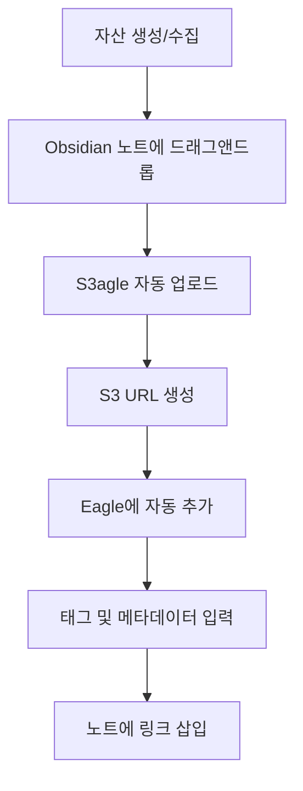

## 📋 개요

마케팅 프로젝트에서는 대량의 이미지, 영상, PDF, 프레젠테이션 파일 등 다양한 디지털 자산이 생성되고 관리됩니다. S3agle 플러그인을 활용하면 이러한 마케팅 자산을 효율적으로 관리하면서 Obsidian Vault의 용량을 최적화하고, 팀 협업과 자산 재사용성을 크게 향상시킬 수 있습니다.

## 🎯 마케팅 자산 관리의 필요성

### 📊 마케팅 프로젝트에서 생성되는 자산 유형

| 자산 유형 | 예시 | 용량 특성 | 관리 필요성 |
|---|---|---|---|
| **이미지** | 배너, 인포그래픽, 제품 사진, 스크린샷 | 중간~대용량 | 높음 |
| **영상** | 광고 영상, 튜토리얼, 케이스 스터디 | 대용량 | 매우 높음 |
| **PDF** | 제안서, 브로셔, 가이드라인, 레퍼런스 | 중간 | 높음 |
| **프레젠테이션** | PPT, 키노트 파일 | 중간~대용량 | 높음 |
| **디자인 파일** | Figma, Sketch, PSD 원본 | 대용량 | 매우 높음 |

### 💡 마케팅 자산 관리의 핵심 과제

1. **Vault 용량 관리**: 대용량 파일로 인한 동기화 속도 저하 및 저장 공간 부족
2. **자산 재사용성**: 여러 프로젝트에서 동일한 자산을 효율적으로 재사용
3. **버전 관리**: 자산의 수정 이력 및 최신 버전 추적
4. **접근성**: 여러 장치에서 자산에 빠르게 접근
5. **협업 효율성**: 팀원 간 자산 공유 및 관리

## 🚀 S3agle 기반 마케팅 자산 관리 전략

### 1️⃣ S3 버킷 폴더 구조 설계

S3agle 플러그인 설정에서 버킷 폴더를 체계적으로 구성하여 자산을 분류하고 관리합니다.

```
s3-bucket/
├── marketing-assets/
│   ├── 01_brand-identity/
│   │   ├── logos/
│   │   ├── color-palettes/
│   │   └── typography/
│   ├── 02_landing-pages/
│   │   ├── hero-images/
│   │   ├── product-shots/
│   │   └── testimonials/
│   ├── 03_ad-campaigns/
│   │   ├── display-ads/
│   │   ├── video-ads/
│   │   └── social-media/
│   ├── 04_content/
│   │   ├── blog-images/
│   │   ├── infographics/
│   │   └── thumbnails/
│   ├── 05_references/
│   │   ├── competitor-analysis/
│   │   └── industry-trends/
│   └── 06_project-specific/
│       ├── asan-baebang-woobang/
│       └── [other-projects]/
```

**설정 방법:**
- S3agle 플러그인 설정 → `folder` 필드에 `marketing-assets` 입력
- 각 프로젝트별로 하위 폴더를 자동 생성하도록 파일명에 경로 포함

### 2️⃣ 파일 명명 규칙 (Naming Convention)

일관된 명명 규칙을 적용하여 자산을 쉽게 찾고 관리할 수 있도록 합니다.

#### 📝 명명 규칙 템플릿

```
[프로젝트코드]_[자산유형]_[용도]_[날짜]_[버전].[확장자]
```

**예시:**
- `ABW_IMG_HERO_20250127_v1.jpg` (아산배방우방 아이유쉘 히어로 이미지)
- `ABW_VID_AD_20250127_v2.mp4` (광고 영상)
- `ABW_PDF_BROCHURE_20250127_final.pdf` (브로셔 PDF)

#### 🏷️ 프로젝트 코드 체계

| 프로젝트 | 코드 | 설명 |
|---|---|---|
| 아산배방우방아이유쉘 | ABW | Asan Baebang Woobang |
| [다음 프로젝트] | [코드] | [설명] |

#### 📂 자산 유형 코드

| 유형 | 코드 | 설명 |
|---|---|---|
| 이미지 | IMG | 정적 이미지 파일 |
| 영상 | VID | 동영상 파일 |
| PDF | PDF | PDF 문서 |
| 프레젠테이션 | PPT | 프레젠테이션 파일 |
| 오디오 | AUD | 오디오 파일 |

### 3️⃣ Eagle 앱을 활용한 자산 검색 및 관리

Eagle 앱을 S3agle과 함께 사용하면 시각적 검색과 태그 기반 관리가 가능합니다.

#### 🎨 Eagle 활용 전략

1. **태그 체계 구축**
   - 프로젝트 태그: `#아산배방우방`, `#분양`, `#임대`
   - 자산 유형 태그: `#배너`, `#영상`, `#인포그래픽`
   - 용도 태그: `#랜딩페이지`, `#광고`, `#소셜미디어`
   - 상태 태그: `#최종본`, `#작업중`, `#레퍼런스`

2. **Eagle 컬렉션 구조**
   ```
   Eagle Library/
   ├── 브랜드 자산
   ├── 프로젝트별 자산
   │   ├── 아산배방우방아이유쉘
   │   └── [다른 프로젝트]
   ├── 재사용 가능 자산
   └── 레퍼런스
   ```

3. **S3 링크 자동 저장**
   - S3agle이 업로드한 파일의 S3 URL이 Eagle의 "website" 필드에 자동 저장됨
   - Eagle에서 자산을 찾으면 S3 링크를 바로 확인 가능

### 4️⃣ 워크플로우 설계

#### 📥 신규 자산 추가 워크플로우



**단계별 가이드:**

1. **자산 준비**
   - 디자인 도구에서 내보내기 (Figma, Photoshop 등)
   - 또는 외부에서 수집한 이미지/영상

2. **Obsidian에 추가**
   - 프로젝트 노트나 관련 문서에 파일을 드래그 앤 드롭
   - 또는 클립보드에서 붙여넣기 (이미지 캡처 등)

3. **자동 업로드 확인**
   - S3agle이 자동으로 S3에 업로드
   - 로컬 파일은 Vault에서 제거되고 S3 URL로 대체됨

4. **Eagle에서 정리**
   - Eagle 앱에서 업로드된 자산 확인
   - 태그, 컬렉션, 메타데이터 추가

#### 📤 기존 자산 일괄 업로드 워크플로우

프로젝트 초기 설정 시 기존 Vault의 모든 자산을 한 번에 업로드:

1. **명령어 실행**
   - `Cmd+P` (Mac) 또는 `Ctrl+P` (Windows)
   - `S3agle: Upload ALL files to S3/Eagle` 선택
   - 현재 노트의 모든 파일이 자동 업로드됨

2. **대량 업로드 전략**
   - 프로젝트별로 노트를 나누어 순차적으로 업로드
   - 각 노트 업로드 후 결과 확인

#### 🔄 자산 재사용 워크플로우

1. **Eagle에서 자산 검색**
   - 태그, 컬렉션, 또는 시각적 검색으로 원하는 자산 찾기

2. **S3 링크 확인**
   - Eagle의 "website" 필드에서 S3 URL 확인
   - 또는 Obsidian 노트에서 기존 링크 복사

3. **새 노트에 삽입**
   - 마크다운 이미지 문법으로 직접 삽입: ``
   - 또는 Eagle에서 자산을 드래그하여 Obsidian에 추가 (향후 기능)

### 5️⃣ 프로젝트별 자산 관리 전략

#### 📁 현재 프로젝트 구조에 맞춘 적용

```
07_프로젝트_데이터베이스/
├── 재사용_자산_라이브러리/
│   ├── 이미지_소재/  → S3: marketing-assets/04_content/
│   └── 영상_소재/    → S3: marketing-assets/03_ad-campaigns/video-ads/
└── 현장별_프로젝트/
    └── 아산배방우방아이유쉘/
        ├── 레퍼런스/  → S3: marketing-assets/06_project-specific/asan-baebang-woobang/references/
        ├── 광고_캠페인/ → S3: marketing-assets/06_project-specific/asan-baebang-woobang/ad-campaigns/
        └── 콘텐츠/    → S3: marketing-assets/06_project-specific/asan-baebang-woobang/content/
```

#### 🎯 프로젝트 노트 Frontmatter 활용

각 프로젝트 노트의 frontmatter에 S3agle 설정을 추가하여 프로젝트별 동작을 제어:

```yaml
---
project_code: ABW
s3_folder: marketing-assets/06_project-specific/asan-baebang-woobang
S3eagleUploadOnDrag: true
S3agleLocalOnly: false
---
```

**Frontmatter 옵션:**
- `S3eagleUploadOnDrag: true/false`: 드래그 앤 드롭 업로드 활성화/비활성화
- `S3agleLocalOnly: true`: S3 업로드 비활성화 (Eagle만 사용)

### 6️⃣ 특수 자산 유형별 관리 전략

#### 📄 PDF 파일 임베딩

S3agle은 PDF 파일을 Google Docs 뷰어로 임베딩할 수 있습니다.

**활용 시나리오:**
- 제안서, 브로셔, 가이드라인을 노트에 직접 표시
- 레퍼런스 문서를 노트 내에서 바로 확인

**설정:**
- S3agle 설정에서 "Embed PDF files" 옵션 활성화
- PDF 업로드 시 자동으로 임베딩 코드 생성

#### 🎬 프레젠테이션 파일 임베딩

PPT 파일은 Microsoft Office 뷰어로 임베딩 가능합니다.

**활용 시나리오:**
- 클라이언트 제안 프레젠테이션을 노트에 포함
- 내부 브리핑 자료 공유

#### 🖼️ 이미지 최적화 전략

1. **업로드 전 최적화**
   - WebP 형식 사용 (용량 절감)
   - 적절한 해상도로 리사이즈
   - 이미지 압축 도구 활용

2. **파일명 해싱 옵션**
   - S3agle 설정에서 "Hash file names" 활성화
   - 동일 파일 중복 업로드 방지
   - 프라이버시 보호

### 7️⃣ 협업 및 공유 전략

#### 👥 팀원과의 자산 공유

1. **S3 공개 URL 활용**
   - S3 버킷이 Public Read로 설정되어 있으면 URL만 공유해도 접근 가능
   - Obsidian 노트의 이미지 링크를 그대로 복사하여 공유

2. **Eagle 라이브러리 공유**
   - Eagle 라이브러리 폴더를 클라우드 드라이브에 저장
   - 팀원과 라이브러리 폴더 공유 (향후 Eagle 클라우드 기능 활용)

3. **Obsidian Vault 공유**
   - 텍스트 중심의 Vault는 Git으로 관리
   - 자산은 S3에서 관리하여 Vault 크기 최소화

#### 🔐 보안 고려사항

1. **민감한 자산 관리**
   - 내부 전용 자산은 S3 버킷 정책으로 접근 제한
   - 또는 별도의 Private 버킷 사용

2. **접근 키 관리**
   - `accessKeyId`와 `secretAccessKey`는 절대 노출 금지
   - IAM 정책으로 최소 권한 원칙 적용

## 📊 실제 활용 시나리오

### 시나리오 1: 신규 랜딩페이지 제작

1. **디자인 자산 수집**
   - Figma에서 내보낸 이미지들을 `02_랜딩페이지/` 노트에 드래그 앤 드롭
   - S3agle이 자동으로 `marketing-assets/02_landing-pages/`에 업로드

2. **노트에 자산 연결**
   - 업로드된 이미지가 자동으로 마크다운 링크로 변환
   - 랜딩페이지 기획 노트에서 바로 확인 가능

3. **Eagle에서 태그 관리**
   - 모든 랜딩페이지 이미지에 `#랜딩페이지`, `#히어로`, `#제품사진` 태그 추가
   - 향후 유사 프로젝트에서 재사용 용이

### 시나리오 2: 광고 캠페인 자산 관리

1. **캠페인별 폴더 구성**
   - S3: `marketing-assets/03_ad-campaigns/[캠페인명]/`
   - Eagle: "광고 캠페인" 컬렉션 하위에 캠페인별 폴더

2. **자산 버전 관리**
   - 파일명에 버전 번호 포함: `ABW_VID_AD_20250127_v1.mp4`
   - 최종본은 `_final` 접미사 추가

3. **성과 데이터와 연계**
   - 광고 자산 노트에 성과 데이터 노트 링크 연결
   - 어떤 자산이 좋은 성과를 냈는지 추적

### 시나리오 3: 레퍼런스 자료 아카이빙

1. **경쟁사 분석 자료**
   - 경쟁사 웹사이트 스크린샷, 광고 소재 등을 수집
   - `05_references/competitor-analysis/`에 업로드
   - Eagle에 `#경쟁사분석`, `#레퍼런스` 태그 추가

2. **업계 트렌드 자료**
   - 업계 리포트, 인포그래픽 등을 PDF로 저장
   - S3에 업로드하고 노트에 임베딩하여 바로 확인 가능

## ⚠️ 주의사항 및 모범 사례

### ✅ 권장 사항

1. **정기적인 백업**
   - S3 버전 관리 활성화
   - 중요한 자산은 별도 백업 보관

2. **용량 모니터링**
   - S3 사용량 정기적으로 확인
   - 불필요한 자산 정리

3. **명명 규칙 준수**
   - 팀 전체가 동일한 명명 규칙 사용
   - 규칙 문서화 및 공유

4. **태그 체계 유지**
   - Eagle 태그 체계를 일관되게 유지
   - 정기적으로 태그 정리

### ❌ 주의할 점

1. **S3 비용 관리**
   - 스토리지 및 전송 비용 모니터링
   - 불필요한 대용량 파일 업로드 방지

2. **인터넷 연결 의존성**
   - 오프라인 환경에서는 S3 자산 접근 불가
   - 중요한 자산은 로컬 백업 고려

3. **파일 삭제 주의**
   - S3에서 파일 삭제 시 복구 어려움
   - 삭제 전 신중히 검토

4. **버킷 정책 보안**
   - Public Read 설정 시 민감한 정보 노출 주의
   - 필요시 접근 제한 정책 적용

## 🔄 지속적인 개선 전략

### 📈 정기 점검 항목

1. **월간 점검**
   - S3 사용량 및 비용 확인
   - 미사용 자산 정리
   - 태그 체계 점검

2. **분기별 점검**
   - 폴더 구조 재검토
   - 명명 규칙 개선
   - 워크플로우 최적화

3. **연간 점검**
   - 전체 자산 아카이빙 전략 수립
   - 오래된 자산 보관 정책 결정

## 🔗 관련 리소스

- [[obsidian-s3agle-plugin-manual]]: S3agle 플러그인 상세 사용법
- [S3agle GitHub 저장소](https://github.com/turnercore/s3agle): 공식 저장소 및 이슈 트래킹
- [Eagle 공식 사이트](https://eagle.cool): Eagle 앱 다운로드 및 문서

## 📝 체크리스트

### 초기 설정
- [ ] S3 버킷 생성 및 권한 설정 완료
- [ ] S3agle 플러그인 설치 및 설정 완료
- [ ] Eagle 앱 설치 및 실행 확인
- [ ] S3 폴더 구조 설계 완료
- [ ] 파일 명명 규칙 문서화 완료

### 워크플로우 구축
- [ ] 신규 자산 추가 워크플로우 테스트
- [ ] 기존 자산 일괄 업로드 완료
- [ ] Eagle 태그 체계 구축 완료
- [ ] 프로젝트별 Frontmatter 템플릿 작성

### 정기 관리
- [ ] S3 사용량 모니터링 시스템 구축
- [ ] 자산 정리 일정 수립
- [ ] 팀원 교육 및 가이드 공유

